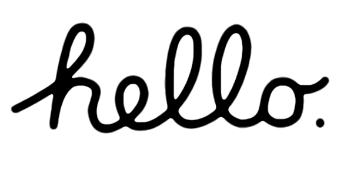
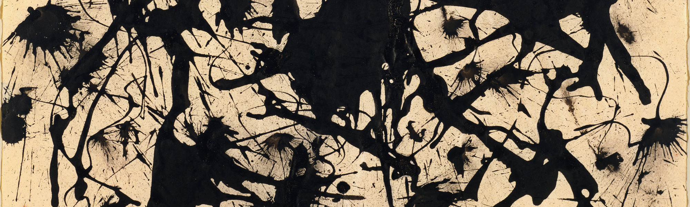

<a href="https://www.youtube.com/watch?v=2B-XwPjn9YY">

    

</a>

<h2>About</h2>
|  
| -- front-end dev from Poland  
| -- i promise i will update my repos here (been using GitLab and Azure lately)  
| -- designer/developer/maintainer of <a href="https://tapicerstwo-stalmach.pl">tapicerstwo-stalmach.pl</a>  
| -- currently learning about UI design
</ul>

<h2>Stack</h2>

<table>
    <tr>
        <td>
        <h3>Front-end</h3>

<h3>Back-end</h3>

  

<h3>Tools</h3>
 
 

        </td>
        <td width="400" align="center">

        </td>
    </tr>
</table>

<h2>Contact me</h2>

  

